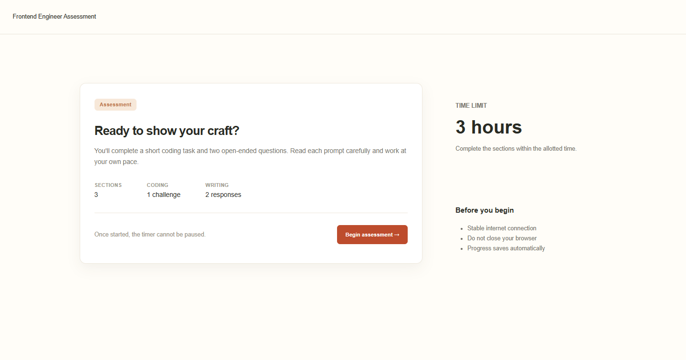
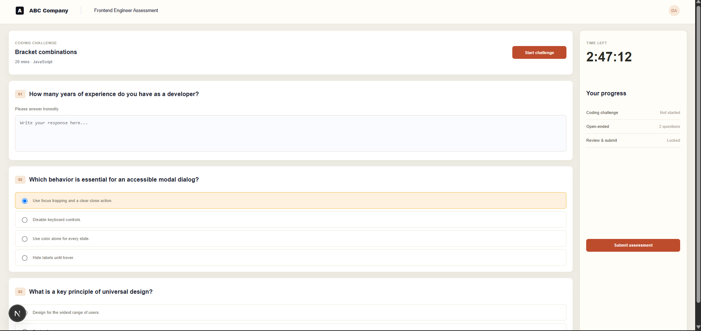
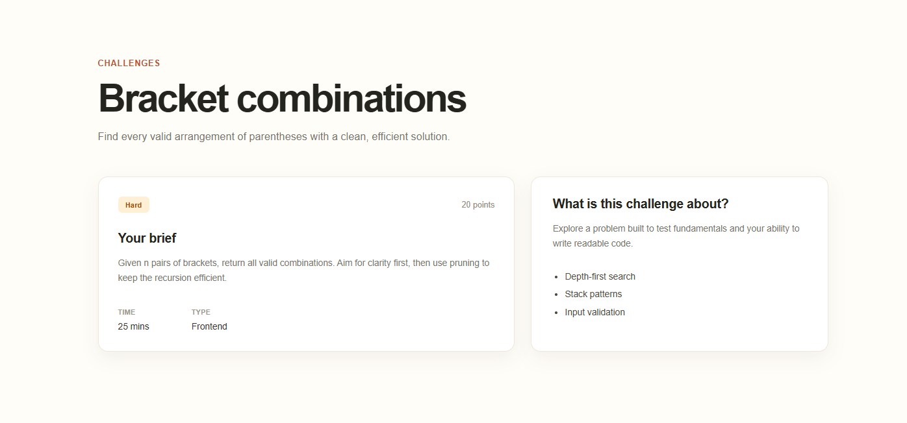
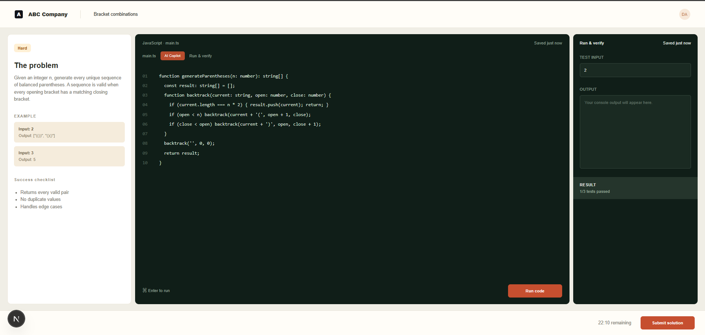

# InterviewOS

A modern interview assessment platform designed to provide a structured environment for candidates to complete coding challenges and open-ended assessment questions.

## Overview

InterviewOS provides a complete assessment flow — from starting an assessment to solving coding problems and submitting responses.

The application combines:

- Timed assessments
- Open-ended questions
- Coding challenges
- In-browser code editor
- Test input and output verification
- Progress tracking
- Challenge-specific instructions
- Persistent assessment state

## 📸 Screenshots

### 1. Assessment Landing

Candidates begin with an overview of the assessment, including the time limit, number of sections, coding challenges, and required responses.



### 2. Assessment Questions

The assessment interface provides open-ended and multiple-choice questions while displaying the candidate's progress and remaining time.



### 3. Coding Challenge

Each coding challenge includes the problem statement, examples, success criteria, difficulty, estimated time, and concepts being evaluated.



### 4. Coding Workspace

Candidates can write and run their solution directly in the browser, provide test input, inspect output, and verify their implementation before submission.



## ✨ Features

- **Timed assessments** with automatic progress tracking
- **Multiple question types** including open-ended and multiple-choice questions
- **Interactive coding environment** for solving programming challenges
- **Run & verify** workflow for testing solutions
- **Challenge details** with examples, requirements, and evaluation criteria
- **Progress tracking** across assessment sections
- **Responsive and clean UI**
- **Automatic saving** of assessment progress

## 🛠️ Tech Stack

- **Framework:** Next.js
- **Language:** TypeScript / JavaScript
- **Frontend:** React
- **Styling:** Tailwind CSS
- **Package Manager:** npm

## 📁 Project Structure

```text
interviewos-buggy/
├── components/          # Reusable UI components
├── pages/               # Application pages and API routes
├── public/
│   └── screenshots/     # Application screenshots
├── styles/              # Global styles
├── package.json
├── package-lock.json
└── README.md